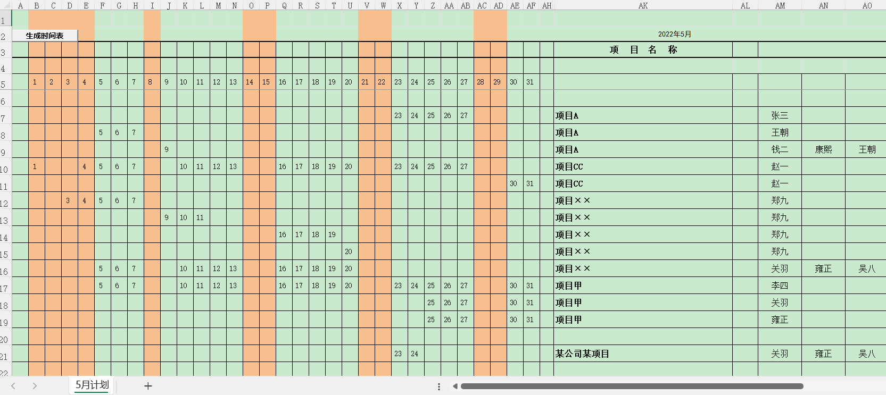

# 📖开发背景说明  
本人在天健会计师事务所工作多年，主要从事财务审计工作。针对工作实务中的一些需求，尝试开发自动化工具来提高效率。  
🤔早期使用Excel VBA工具，但存在明显短板：  
　 ●和VBA代码绑定单一工作簿，无法全局复用；  
　 ●新版`.xlsx`格式不再支持内嵌VBA宏，仅老旧`.xls`兼容，分发、使用不方便。  
😄解决方案：基于 Visual Studio 开发 Office 独立加载项  
　 ●安装后在Excel/WPS顶部生成专属菜单栏，全局生效，不受工作簿格式限制，使用便捷。

本着开源分享的初衷，我现在尝试将项目完整托管于 GitHub：  
✅完整源码开源：开发人员可自行查阅、二次改造；  
✅免源码安装包：普通同事直接下载EXE/MSI安装包，安装使用。  

工具命名为**审计之刃**，更新、BUG修复、新功能迭代全部统一在GitHub维护。  
安装后打开Excel/WPS，顶部菜单栏会新增「审计之刃」专属Tab，分为两大功能分区：  
🔧通用功能区：全审计项目通用工具  
🧾项目专属功能区：按集团客户定制，存放该客户专项底稿自动化工具。  

# 🛠️ 具体功能介绍 & 操作说明  
## 1. 通用功能区｜月计划高亮名字  
### 😫业务痛点  
我所在的天健业务部门，工作计划安排是按照月度发布的，发布后会经常修改更新。如下面截图所示，左侧是天数，右侧列示项目名称和项目组成员，比如员工“雍正”在16行、19行、21行都有项目安排，其他人也涉及多项目安排。截图只截取了本月安排的一部分，下面还有很多，有90多行。查看自己及查看他人的月度项目安排情况，很不方便。  

### 💡问题解决思路  
如果用鼠标点击某一人名，如左键单击“雍正”，计划表中所有的“雍正”都以某颜色高亮显示，这样查看计划安排就很方便了。  
### 📝使用说明
- 打开部门下发月度计划 `.xls` 文件（Excel/WPS均兼容），切换至【月计划】sheet表；
- 点击顶部「审计之刃」→【月计划高亮名字】功能按钮；
- 弹窗提示 `VBA代码已成功写入工作表！`，点击确定关闭弹窗；
- 单击任意人名，对应内容自动黄色高亮。
>持久化特性：执行一次后，该工作簿永久保留高亮功能，再次打开无需重复操作。

# 写在最后  
## 📥安装包直达下载
普通用户无需研究源码，直接下载安装包部署：
[👉 v1.0.0 正式版安装包发布网页](https://github.com/AaronChaolong/audit-dagger/releases/tag/v1.0.0)  
一键直下EXE（点开自动下载，无需进入发布网页）：
[AuditDagger-v1.0.0.exe](https://github.com/AaronChaolong/audit-dagger/releases/download/v1.0.0/Audit-Dagger_v1.0.0.exe)

## 🌐后续规划与反馈渠道  
当前仅上线「月度计划高亮」试用功能，收集使用反馈后持续迭代新增工具；  
先用这个小功能学习GitHub维护、发布代码的操作方法；  
下一个解锁功能：**一键提取薪酬分配差异**（收集满10个项目Star点赞后更新发布）。  

### 📮 反馈&联系方式
- GitHub：提交 Issues 反馈BUG、提出新功能开发需求；
- QQ：852689531；
- 内部渠道：天健同事可直接企业微信联系 赵成龙。

### ⭐ 点亮Star支持
工具对你的审计工作有帮助的话，欢迎点亮项目Star：
[👉 点击进入项目主页，右上角☆ Star点击](https://github.com/AaronChaolong/audit-dagger)